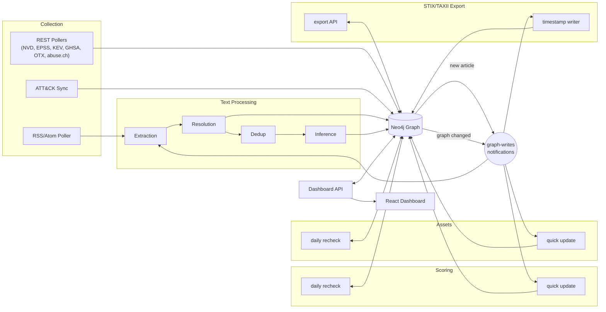

# Architecture

This platform is a serverless, event-driven pipeline. Layers communicate with each other through two mechanisms:

- **`graph-writes`** A shared notification topic for graph changes where subscribers filter by event type.
- **NLP queues** - Consists of extraction, resolution, deduplication, and inference queues that each hand work to the next stage.

## The pipeline

## Event updates and sweeps

Scoring and asset matching have two paths:

- **Event handler:** updates affected records after a graph change.
- **Daily sweep:** recalculates all records, catches missed events, and removes stale asset matches.

Both paths are safe to retry.

## Brief overview of the pieces

| Stage | Code | What it does |
|---|---|---|
| Collection | `src/collection` | Pulls in raw articles for text processing and writes reference data directly to the graph |
| Text Processing | `src/nlp` | Finds entities in text, matches them to known records, groups related articles, and infers relationships |
| Graph writes | `src/common/graph` | Shared graph write and notification code |
| Scoring | `src/scoring` | Rates severity, relevance, and confidence |
| STIX/TAXII Export | `src/interop` | Publishes the graph in a standard threat-intel exchange format |
| Dashboard API | `src/delivery` | The read/write API behind the dashboard |
| Assets | `src/assets` | Matches a user's own software inventory against known vulnerabilities |

See [Data Model](data-model.md) for stored entities and [Lambda Handlers](handlers.md) for triggers and routes.
