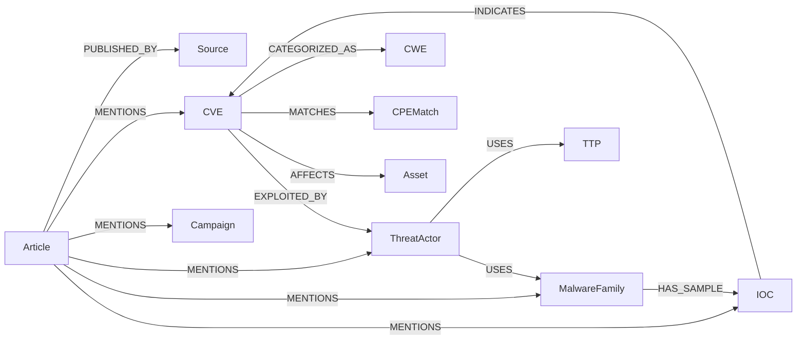

# Data Model

Neo4j stores entities as nodes and their connections as edges. 
The source of truth for labels, keys, and indexes is in `src/common/schema_bootstrap.py`.

## Node Labels

| Label | Identified by | Notes |
|---|---|---|
| `Source` | its URL | A feed, blog, or advisory source |
| `Article` | source + guid | Has an embedding used for the Q&A search feature |
| `CVE` | CVE ID | |
| `CWE` | CWE ID | A weakness category a CVE can be tagged with |
| `TTP` | technique ID | A MITRE ATT&CK technique |
| `ThreatActor` | merge key | |
| `MalwareFamily` | merge key | |
| `Campaign` | merge key | |
| `IOC` | value + type | An indicator of compromise (IP, hash, domain, etc.) |
| `CPEMatch` | match ID | NVD data on which product versions a CVE affects |
| `Asset` | vendor + product + version | A user-managed software inventory item |

## Edge Types

Only assertion edges affect relevance scoring while Provenance and category edges do not.

**Assertions** are claims that affect relevance scoring:

| Edge | Meaning |
|---|---|
| `EXPLOITED_BY` | A CVE was exploited by an actor or campaign |
| `USES` | An actor or campaign uses a technique or malware family |
| `HAS_SAMPLE` | A malware family has an observed sample |
| `COMMUNICATES_WITH` | An infrastructure relationship |
| `ASSOCIATED_WITH` | Always points to an `IOC` |
| `INDICATES` | An IOC points to a CVE |
| `ATTRIBUTED_TO` | An attribution relationship |

**Provenance** records where data came from and do not affect scoring:

| Edge | Direction | Meaning |
|---|---|---|
| `MENTIONS` | Article -> entity | An article mentions something |
| `PUBLISHED_BY` | Article -> Source | Where an article came from |

**Categorization** tags and links data, but doesn't affect scoring:

| Edge | Direction | Meaning |
|---|---|---|
| `CATEGORIZED_AS` | CVE -> CWE | Which weakness category a CVE falls under |
| `MATCHES` | CVE -> CPEMatch | Candidate join used by asset matching |

**Asset matching** is derived from a user's managed inventory:

| Edge | Direction | Meaning |
|---|---|---|
| `AFFECTS` | CVE -> Asset | A current CVE-to-asset match and is removed when it no longer holds |

## Diagram

See [Architecture](architecture.md) for how these get written, and the [Code Reference](reference/src/common/graph/index.md) for the shared code every write goes through.
