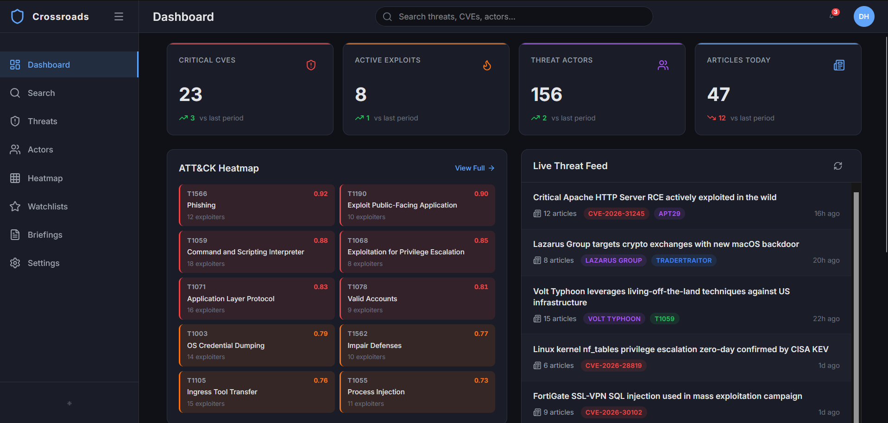

# Threat Intelligence Platform

This platform collects various sources of threat-intelligence data, stores the results in Neo4j, scores the graph, and exposes it through a dashboard API and TAXII/STIX.



## Start here

- [Architecture](architecture.md) - data flow and service boundaries.
- [Technology Stack](technology-stack.md) - languages, frameworks, libraries, tools, and services.
- [Repo Tour](guided-tour.md) - where to make a change.
- [Runbook](runbook.md) - local setup, configuration, and deployment.

## Reference

- [Data Model](data-model.md) - Neo4j labels and relationships.
- [Lambda Handlers](handlers.md) - deployed handlers, triggers, and routes.
- [Infrastructure](infra.md) - CDK stacks and shared resources.
- **Code Reference** - generated from source docstrings in the site navigation.

## Local development

Requires Python 3.12 and Docker.

```bash
pip install -e ".[dev]"
docker compose up -d
pytest
```

Serve the docs with:

```bash
pip install -e ".[docs]"
mkdocs serve
```
