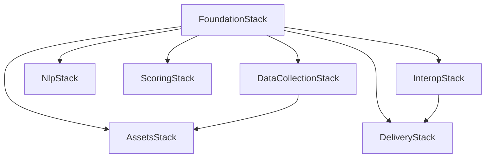

# Infrastructure

`infra/app.py` defines one CDK app. All stacks depend on the `FoundationStack`. 
Stack names include the deployment environment allowing separate environments.

## FoundationStack

The Foundation Stack deploys first to provide:

- The `graph-writes` notification topic.
- A Neo4j schema bootstrap job at deploy.
- DynamoDB tables for operational state:

| Table | Key | Used for |
|---|---|---|
| `Sources` | source ID | Feed/source configuration |
| `PollingState` | source ID | Polling checkpoint |
| `DedupState` | source ID + guid | Seen RSS articles |
| `RECache` | content hash | Relationship-inference cache |
| `RevokedStixIds` | STIX ID | Withdrawn exported objects |

## Remaining Stacks

Location: `infra/stacks/`

| Stack | Depends on | Provisions |
|---|---|---|
| `DataCollectionStack` | Foundation | The feed pollers, text extraction Lambda, its queue, and their schedules |
| `NlpStack` | Foundation | The text-processing pipeline and its queues |
| `ScoringStack` | Foundation | The scoring functions |
| `InteropStack` | Foundation | The STIX/TAXII export API |
| `DeliveryStack` | Foundation, Interop | Dashboard API and its routes |
| `AssetsStack` | Foundation, DataCollection | The asset-matching functions |

## Shared Constructs

Location: `infra/constructs/`

- `queue_with_dlq.py` - an NLP queue with a dead-letter queue.
- `graph_writes_topic.py` - graph-change topic and filtered subscriptions.
- `iam_helpers.py` - permission helpers.
- `schema_bootstrap_job.py` - deploy-time Neo4j schema setup.

## Local development

`docker-compose.yml` runs a local Neo4j and local DynamoDB in place of these AWS resources. See [Runbook](runbook.md) for more information.
